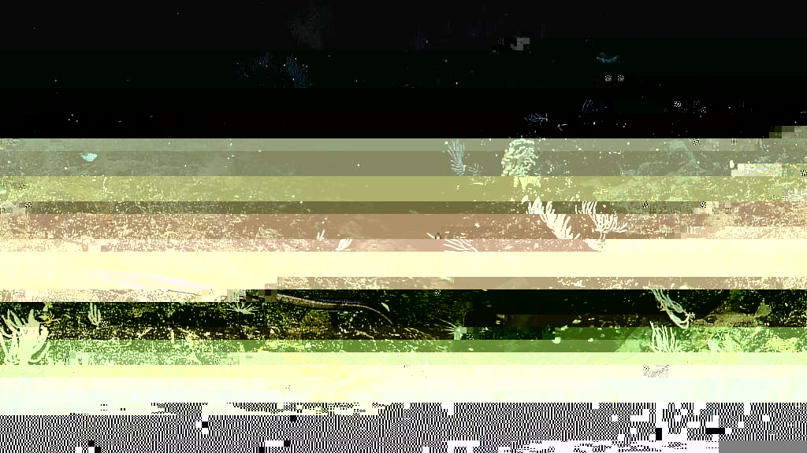

# undesignated

"There are no beautiful surfaces without a terrible depth."
- Friedrich Nietzsche

## Description

This repository is called "undesignated" because it contains various scripts that have not had an independent repository created for them.  This is either because they are still a work in progress or because they don't really warrant needing their own repository.  A "catch all", more or less.

## Technologies Used

The scripts contained in this repository vary from Bash, to Python, to PowerShell and everything in between.
